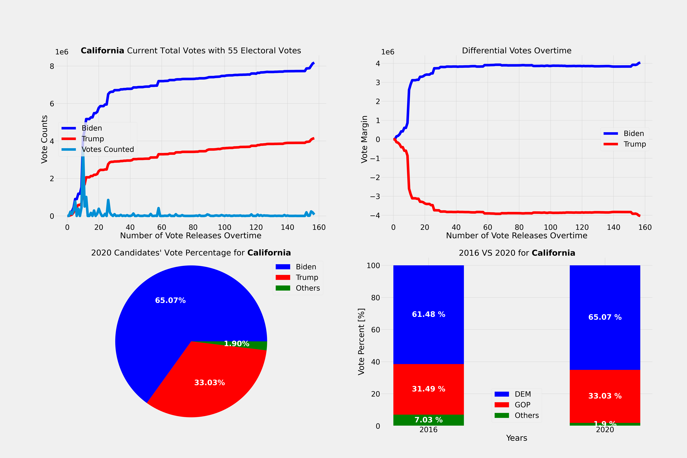

This simple Ipython script plots different ways the US 2020 Election Data that were retrieved from:  

https://github.com/alex/nyt-2020-election-scraper  

To use this script:

Simply download the repo, run it in JupyterLab and enjoy the beautiful figures which you can modify as you please!  

Sample:  

  

Disclaimer: this is only for visualization purposes. Data are not quite accurate, consult official sites for more accrate data. Also I am not a programmer, so the code might be rough :)

#USElection2020
